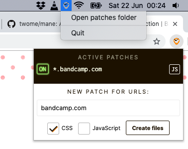

# Mane

<small><i>Short for "do<b>main</b> patcher"</i></small>

##### Status: pre-alpha; not for public use

#### Security warnings:

- Treat your patches folder as if it were public: currently, any malicious website's JavaScript can request anything on the Mane server over `localhost`, and the Mane server doesn't yet discern who's asking, so it will respond freely. This will be fixed before leaving alpha.

---



Mane is a native app for your menubar / system tray *and* a browser extension, which work together to automatically insert modifications (namely, JavaScript and CSS) into websites of your choosing each time you visit them. These "patches" are stored in a folder on your hard drive or a remote Git repository *[upcoming feature]*, so you can use patches made by other people and keep them in your cloud files with no fuss or accounts necessary. With Mane, you could: hide sticky headers, add keyboard shortcuts to music players, perform some triage on hideous colour choices, or cut out annoyances (that aren't *technically* ads) which adblockers ignore… jury-rig any part of the web to your liking!

This is similar in approach to [GreaseMonkey](https://addons.mozilla.org/en-US/firefox/addon/greasemonkey/)/[TamperMonkey](https://chrome.google.com/webstore/detail/tampermonkey/dhdgffkkebhmkfjojejmpbldmpobfkfo), and '[User Javascript & CSS](https://chrome.google.com/webstore/detail/user-javascript-and-css/nbhcbdghjpllgmfilhnhkllmkecfmpld)' on Chrome, but with an emphasis on a simple & nice user interface, and being able to edit and store patches in whatever way suits you (instead of uncomfortable code editors and databases).

## Installation

You need to run the extension AND the server simultaneously (don't worry, the server immediately hides itself in the menubar / system tray and doesn't make a peep).

#### Server (to read and write patches as files)

Either:

**CLI**: Clone this repo, then, from the command line, `cd` into it, run `yarn install` to fetch dependencies, & then `yarn start-cli` to start the Node server on `localhost:1917` by default.

**OR**

**macOS Electron app**: Run `yarn native` to launch the GUI app. It will briefly appear in the Dock, then move to the menubar/tray. No pre-packaged executables are ready yet, sorry!

#### Browser extension (to inject patches into webpages) 

Turn on 'developer/debug mode' in your browser's extension manager, then load this repo's `src/extension/` folder as an "unpacked extension" (the terminology may vary).

[Properly packaged extension files & browser extension store links will come soon.]

## Usage

First, a note on terminology: Here, we refer to a *"patch"* to mean *"a collection of JS and CSS files that are activated according to their list of URL matchers"*. "Matchers" are strings, like [regular expressions](https://regexr.com/), which Mane checks against the browser's current URL. If any of a patch's matchers match the current page's URL, the browser extension will inject all of its files into the page.

You can quickly make a new patch that matches the current page's **domain** (eg. the matcher `google.com` - which matches `maps.google.com`, `www.google.com`, and `google.com/a-search-result`) by clicking 'New patch' in the Mane browser extension's popup. This will automatically create a new empty CSS and/or JS file in your Mane patches folder (by default, `~/.mane-patches`), and then immediately open them in your OS's default code editor.

You can disable a patch using the browser extension's popup (which will list any patches matching the current page), or by including a comment in the patch file(s) that looks like this [TODO]:

```javascript
/* mane-options active:false */
```

(The extension will automatically write this special comment into the top of the patch files.)

### Advanced URL matching

You don't need to use the extension to create a patch; it's only a convenience. You can simply make a new file in your Mane patches directory. Name the file with the exact text of the matcher list you want to use, plus `.js` or `.css`. For example, to make a patch that styles all artist subdomains on Bandcamp, but not the main Bandcamp page itself, you would create:

```
*.bandcamp.com.css
```

To just match *any* Bandcamp page, you would create:

```
bandcamp.com.css
```

If you wanted to apply a patch on any Bandcamp *or* Spotify page with the same JavaScript (eg. to automatically click the 'Play' button), you would create a **comma-separated list** of matchers:

```
bandcamp.com,spotify.com.js
```

(Don't worry: URLs can't include commas, so there's no potential for confusion.)

To add some CSS *and* some JavaScript that run on the same matcher (which would together form one patch), create one of each file with the **same filename, but different extensions**:

```
bandcamp.com.css
bandcamp.com.js
```

## Interaction with the filesystem

Normally, a filename for a patch will simply be the `matchList` concatenated into a comma-separated string. For very large matchlists, this could easily become very unwieldy. It's also a bit risky to create gigantic path names; lots of programs don't deal well with excessive filenames. Instead, if you give the Mane extension a very long list of matchers in the "New patch" section, Mane will automatically: 
	
1. give this patch an ID/name that includes a sample of a few of the matches (for human readability)
1. name the patch files, or "assets", with that ID
1. put them in a folder named after that ID [TODO]
1. insert this special comment: `/* patch-urls <matches string goes here> */` at the top of each asset's code

When applying patches, we'll resolve each domain by:
	
1. looking for a match in asset (JS/CSS) filenames in the root of your patches folder, then
1. looking for a match in folder names (which will apply all files in the folder) [TODO], then
1. [TODO] looking for a match in `folderName/matches.txt` (which will apply all files in the folder), then
1. (optional & slow) looking for a custom comment in the first non-whitespace line of every asset: `/* patch-urls <matchers string goes here> */`

The app should cache an index file of the locations and contents of assets for for every patch, as looking through so many files on disk will be very slow. It should also cache the contents of the assets in *memory* for repeated visits to pages with the same matchers.

## We use the work of:

- Icons made by Google, from www.flaticon.com. License: `CC 3.0 BY`
- [Windows icons by Icons8](https://icons8.com/windows-icons)

## License

[MIT](https://opensource.org/licenses/MIT)
